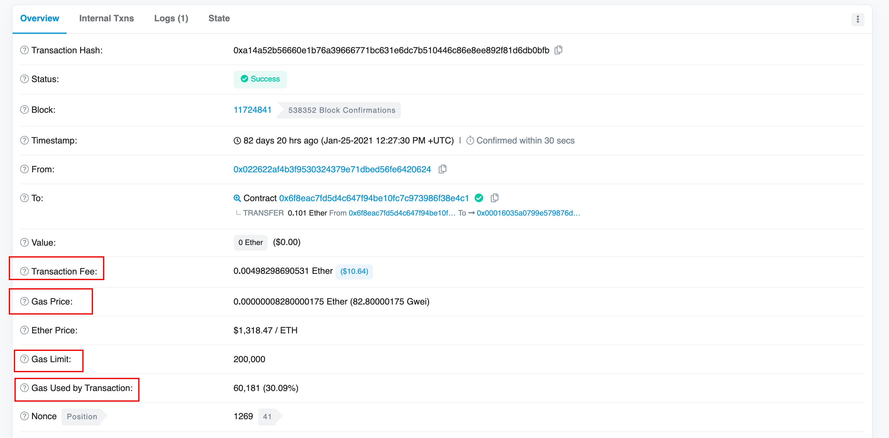

# Eth 里面 gas price ，gas limit ，手续费之间的关系
在以太坊里面收手续费不是直接说多少以太币的，而是用 gas，同样是虚拟货币，你怎么就那么出类拔萃呢？
出类拔萃也就算了，一个 gas 还有 gas price ，gas limit ，Gas Used by Transaction ……一笔交易到底要收多少手续费呢？
本着闲着也是闲着的原则，我决定好好研究一下，不想一直不懂下去了……
## gas price ，gas limit ，手续费之间的关系
其实，所收的手续费是这样计算出来的：

        手续费（以太币单位）=gas price * Gas Used by Transaction

以下图为例子（https://cn.etherscan.com/tx/0xa14a52b56660e1b76a39666771bc631e6dc7b510446c86e8ee892f81d6db0bfb）

图中的 Transaction Fee 就是这笔转账所收的手续费，使用了 0.00498298690531 Ether ，当时价值 10.64 美元。
图中的 Gas Price 是 gas 的价格，是 0.00000008280000175 以太币，相当 82.80000175 Gwei 。
图中的 Gas Limit 是 gas 的限制使用量，是 200000
图中的 Gas Used by Transaction 是 gas 的使用量，是 60181 使用了 gas limit 的 30.09% 。

可以发现：

      Transaction Fee = Gas Price * Gas Used by Transaction
      0.00498298690531 = 0.00000008280000175 * 60181

所以，这笔交易的手续费就是 0.00498298690531 以太币了啊！

它们之间的关系就是这样，是不是很疑惑，gas limit 呢？？？它在交易里面感觉没起什么作用啊？还有，为什么 eth 要设计那么有点 a little 复杂的机制呢？让我们再深入看看。
## 背后的原因
我们都知道，eth 和比特币最大的不同，eth 类似一个虚拟机,不只是可以转账，还可以在上面『运行代码』，
完成各种各样可以想象的东西，也就是智能合约。
以太坊里面的智能合约每执行一些操作，就会收取手续费。而 

    gas price 就是每次操作我愿意为其花费的 eth
    gas limit 就是操作次数的最大值（不可以无限操作，防止有 bug）
    Gas Used by Transaction 就是实际的操作次数

所以

    手续费（Transaction Fee）=每次操作的 eth 价格（Gas Price）*操作的次数（Gas Used by Transaction）

所以 gas 我自己理解就是针对操作的计费名称。这就是 gas 啦~